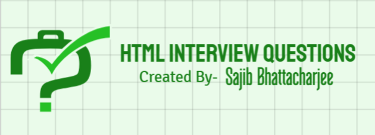

<div align="center">
 


# `Top HTML Interview Questions with Solutions`

</div>

## 📋 Table of Contents

1. [Introduction to HTML](#1-introduction-to-html)
2. [Basic HTML Questions](#2-basic-html-questions)
3. [Forms and Input](#3-forms-and-input)
4. [HTML5 Features](#4-html5-features)
5. [Multimedia Elements](#5-multimedia-elements)
6. [HTML Semantics](#6-html-semantics)
7. [Advanced HTML Concepts](#7-advanced-html-concepts)
8. [Performance Optimization](#8-performance-optimization)

---

## 1. 📝 Introduction to HTML

### 1.1 What is HTML? 🌐

**Answer:**
HTML (HyperText Markup Language) is the standard language for creating web pages. It uses tags to structure content on the web.

### 1.2 What are the main features of HTML? ✨

**Answer:**

- Easy to learn and use.
- Supports multimedia like images, audio, and video.
- Platform-independent.
- Compatible with CSS and JavaScript for dynamic styling and interactivity.

### 1.3 What is the difference between HTML and XHTML? 🔄

**Answer:**

- HTML: Not strict with syntax.
- XHTML: Strict syntax, requires closing tags and proper nesting.

### 1.4 What are HTML attributes? 🏷️

**Answer:**
Attributes provide additional information about an element.

```html
<a href="https://example.com" target="_blank">Example Link</a>
```

### 1.5 What is the difference between `id` and `class` attributes? 🔑

**Answer:**

- `id`: Unique identifier for an element.
- `class`: Can be shared among multiple elements for styling or behavior.

---

## 2. ⚙️ Basic HTML Questions

### 2.1 What is the difference between `<div>` and `<span>`? 📦

**Answer:**

- `<div>`: A block-level element used to group content.
- `<span>`: An inline element used for styling a part of text.

```html
<div>This is a block-level element.</div>
<span>This is an inline element.</span>
```

### 2.2 What are empty elements in HTML? 🤔

**Answer:**
Empty elements do not have content and are self-closing. Examples:

```html

<br />
<input type="text" />
```

### 2.3 How do you add comments in HTML? 🗨️

**Answer:**
Use `<!-- -->` to add comments:

```html
<!-- This is a comment -->
```

### 2.4 What is the use of the `<meta>` tag? 🌟

**Answer:**
The `<meta>` tag provides metadata about the HTML document, such as character set, description, and viewport settings.

```html
<meta charset="UTF-8" />
<meta name="viewport" content="width=device-width, initial-scale=1.0" />
```

### 2.5 How do you create a hyperlink in HTML? 🔗

**Answer:**
Use the `<a>` tag:

```html
<a href="https://example.com">Visit Example</a>
```

### 2.6 What is the difference between `<ol>` and `<ul>`? 📋

**Answer:**

- `<ol>`: Ordered list with numbered items.
- `<ul>`: Unordered list with bullet points.

```html
<ol>
  <li>Item 1</li>
  <li>Item 2</li>
</ol>
<ul>
  <li>Item A</li>
  <li>Item B</li>
</ul>
```

---

## 3. 🖊️ Forms and Input

### 3.1 How do you create a form in HTML? 📄

**Answer:**

```html
<form action="submit.php" method="post">
  <label for="name">Name:</label>
  <input type="text" id="name" name="name" />
  <input type="submit" value="Submit" />
</form>
```

### 3.2 What are the different input types in HTML? 🔤

**Answer:**

- `text`
- `password`
- `email`
- `number`
- `date`
- `file`

Example:

```html
<input type="email" placeholder="Enter your email" />
```

### 3.3 How do you group form elements? 🔲

**Answer:**
Use the `<fieldset>` tag:

```html
<fieldset>
  <legend>Personal Information</legend>
  <label for="name">Name:</label>
  <input type="text" id="name" name="name" />
</fieldset>
```

### 3.4 What is the purpose of the `<label>` tag? 🏷️

**Answer:**
The `<label>` tag associates a label with an input field for better accessibility.

---

## 4. 🆕 HTML5 Features

### 4.1 What are the new semantic elements in HTML5? 🏷️

**Answer:**

- `<header>`
- `<footer>`
- `<article>`
- `<section>`
- `<aside>`

### 4.2 How does the `<canvas>` element work? 🎨

**Answer:**
The `<canvas>` element is used to draw graphics via JavaScript.

```html
<canvas id="myCanvas" width="200" height="100"></canvas>
<script>
  const canvas = document.getElementById("myCanvas");
  const ctx = canvas.getContext("2d");
  ctx.fillStyle = "blue";
  ctx.fillRect(20, 20, 150, 75);
</script>
```

### 4.3 What is the `<datalist>` tag? 📋

**Answer:**
The `<datalist>` tag provides autocomplete options for input fields.

```html
<input list="browsers" />
<datalist id="browsers">
  <option value="Chrome"></option>
  <option value="Firefox"></option>
  <option value="Edge"></option>
</datalist>
```

### 4.4 How do you define the document type in HTML5? 📄

**Answer:**

```html
<!DOCTYPE html>
```

### 4.5 What is the purpose of the `<main>` tag? 🧩

**Answer:**
The `<main>` tag represents the main content of the document.

---

## 5. 🎥 Multimedia Elements

### 5.1 How do you embed a video in HTML? 🎬

**Answer:**
Use the `<video>` tag:

```html
<video controls>
  <source src="video.mp4" type="video/mp4" />
  Your browser does not support the video tag.
</video>
```

### 5.2 How do you add an audio file? 🎵

**Answer:**
Use the `<audio>` tag:

```html
<audio controls>
  <source src="audio.mp3" type="audio/mpeg" />
  Your browser does not support the audio element.
</audio>
```

### 5.3 What is the difference between `<embed>` and `<object>`? 📎

**Answer:**

- `<embed>`: Embeds external content, like videos or documents.
- `<object>`: Embeds resources like Java applets or Flash.

```html
<embed src="file.pdf" />
<object data="file.pdf" type="application/pdf"></object>
```

---

## 6. 📄 HTML Semantics

### ❓ Question 1: What is semantic HTML, and why is it important?

**💡 Answer:**  
Semantic HTML uses tags that convey meaning (e.g., `<header>`, `<footer>`, `<article>`), improving:

- **🦾 Accessibility:** Assists screen readers in interpreting content.
- **🌐 SEO:** Enhances search engine understanding.
- **🔧 Maintainability:** Makes code more readable and structured.

---

### ❓ Question 2: 🛠️ How do semantic tags improve webpage structure?

**💡 Answer:**  
Semantic tags like `<header>`, `<footer>`, and `<section>` organize content logically:

- `<header>`: Introductory content or navigation.
- `<footer>`: Closing info like copyrights.
- `<section>`: Thematic content grouping.

---

### ❓ Question 3: 🆚 Compare `<div>` with semantic elements like `<main>` and `<article>`.

**💡 Answer:**

- `<div>`: Non-semantic; used for styling/layout.
- `<main>`: Marks the main content of a page.
- `<article>`: Self-contained, reusable blocks (e.g., blog posts).  
  Semantic elements improve structure, accessibility, and SEO.

---

### ❓ Question 4: 🚀 How does semantic HTML enhance accessibility?

**💡 Answer:**  
Semantic elements improve the experience for assistive technologies:

- `<nav>`: Signifies navigation links.
- `<aside>`: Indicates complementary content.
- `<main>`: Highlights the main content for screen readers.

---

### ❓ Question 5: 📜 What’s the difference between `<section>` and `<article>`?

**💡 Answer:**

- **`<section>`:** Groups related content within a document.
- **`<article>`:** Represents standalone content that can be reused.

---

## 7. ⚙️ Advanced HTML Concepts

### ❓ Question 6: 🌱 What is the `<template>` element, and how is it used?

**💡 Answer:**  
The `<template>` holds reusable HTML that isn’t rendered until needed.  
**Example:**

```html
<template id="example-template">
  <p>This is reusable!</p>
</template>
<script>
  const content = document
    .getElementById("example-template")
    .content.cloneNode(true);
  document.body.appendChild(content);
</script>
```

### ❓ Question 7: ✏️ What is the purpose of `contenteditable`?

#### 💡 Answer:

It makes elements editable by users.

#### Example:

```html
<div contenteditable="true">Edit this text!</div>
```

### ❓ Question 8: 🔗 How do custom data attributes (`data-*`) work?

#### 💡 Answer:

They store additional data on elements, accessible via JavaScript.

#### Example:

```html
<div data-user-id="123">User Name</div>
<script>
  console.log(document.querySelector("[data-user-id]").dataset.userId); // Outputs: 123
</script>
```

### ❓ Question 9: 📤 What is the `<dialog>` element?

#### 💡 Answer:

A native modal dialog box for displaying popups.

#### Example:

```html
<dialog open>This is a dialog box!</dialog>
```

### ❓ Question 10: 🖼️ How does the `srcset` attribute improve image loading?

#### 💡 Answer:

`srcset` allows responsive images for different devices.

#### Example:

```html

```

### ❓ Question 11: ⚡ What are async and defer in `<script>`?

#### 💡 Answer:

- **`async`:** Loads the script asynchronously and executes it as soon as it’s ready.
- **`defer`:** Loads the script but executes it only after the DOM is fully parsed.

**Usage:**

- Use `async` for scripts that are independent of the DOM.
- Use `defer` for scripts that are dependent on the DOM.

---

### ❓ Question 12: 💤 How does lazy loading optimize performance?

#### 💡 Answer:

Lazy loading defers the loading of non-essential assets (like images) until they are needed, improving initial page load time.

#### Example:

```html

```

# 8. 🚀 Performance Optimization

### ❓ Question 13: 📦 What is `<link rel="preload">`?

#### 💡 Answer:

`<link rel="preload">` preloads essential resources (like stylesheets, scripts, or images) to improve loading performance.

#### Example:

```html
<link rel="preload" href="styles.css" as="style" />
```

### ❓ Question 14: 🖼️ How can images be optimized for performance?

#### 💡 Answer:

- Use modern formats like WebP for better compression.
- Compress images to reduce their file size.
- Apply `srcset` for responsive loading, adjusting to different screen sizes.
- Implement lazy loading to defer image loading until needed.

---

### ❓ Question 15: ✂️ What is the difference between minification and compression?

#### 💡 Answer:

- **Minification:** Removes unnecessary characters from code (e.g., spaces, comments) to reduce file size without affecting functionality.
- **Compression:** Reduces file size through algorithms (e.g., Gzip) to improve transfer speed.

---

### ❓ Question 16: 🌍 How does a CDN improve performance?

#### 💡 Answer:

A CDN (Content Delivery Network) caches content on servers worldwide, reducing latency by serving assets from the nearest server, which improves page load speed.

---

### ❓ Question 17: 🛠️ What are service workers, and how do they help?

#### 💡 Answer:

Service workers are scripts that run in the background to manage caching and enable offline functionality, improving load times and allowing offline usage.

#### Example:

```javascript
self.addEventListener("install", (event) => {
  event.waitUntil(
    caches
      .open("cache-v1")
      .then((cache) => cache.addAll(["/index.html", "/style.css"]))
  );
});
```

### ❓ Question 18: 🖌️ What is critical CSS?

#### 💡 Answer:

Critical CSS is the minimum CSS required to render above-the-fold content, improving perceived load speed by inlining it directly in the HTML.

---

### ❓ Question 19: 📡 How does HTTP/2 enhance performance?

#### 💡 Answer:

HTTP/2 supports multiplexing, allowing multiple requests over a single connection. This reduces latency and improves page load speed by allowing faster resource fetching.

---

### ❓ Question 20: ⏩ What is `rel="prefetch"`, and when is it used?

#### 💡 Answer:

`rel="prefetch"` hints to the browser to fetch resources in advance for future navigation, optimizing load times when the user navigates to the next page.

#### Example:

```html
<link rel="prefetch" href="next-page.html" />
```

---

## 🌟 Useful Resources for HTML Interview Preparation 🌟

#### 📚 Books:

- 📖 **"HTML and CSS: Design and Build Websites"** by Jon Duckett
- 📖 **"Learning Web Design"** by Jennifer Niederst Robbins

#### 🌐 Websites:

- 🖥️ [**MDN Web Docs - HTML**](https://developer.mozilla.org/en-US/docs/Web/HTML)
- 🖥️ [**W3Schools - HTML Tutorial**](https://www.w3schools.com/html/)

#### 🎥 YouTube Channels:

- 🎬 [**Anisul Islam**](https://www.youtube.com/@anisul-islam)

- 🎬 [**Traversy Media**](https://www.youtube.com/c/TraversyMedia)
- 🎬 [**freeCodeCamp.org**](https://www.youtube.com/c/Freecodecamp)

#### 📝 Practice:

- 💻 [**LeetCode - HTML**](https://leetcode.com)
- 💻 [**HackerRank - HTML**](https://www.hackerrank.com/domains/tutorials/10-days-of-javascript)

---

💡 **Stay curious, Keep learning!**  
💬 **Feel free to reach out if you need any help.** ✨

---

<div align="center">

##### 🛡️ `All rights reserved by Sajib Bhattacharjee @2025`

### 👨‍💻 `Created with ❤️ by -->`

✨ **Sajib Bhattacharjee** ✨

**💖 Dedicated to "Zahan" 💖**

> > > > ### 🙏 Thanks a Lot for Visiting...!!!

🌐 [**Portfolio & Projects**](https://github.com/Sajib-Bhattacharjee)  
💼 [**LinkedIn**](https://www.linkedin.com/in/sajib-bhattacharjee-42682a178/)  
📧 [**Contact Me**](mailto:sajibbhattacjarjee2000@gmail.com)

</div>
